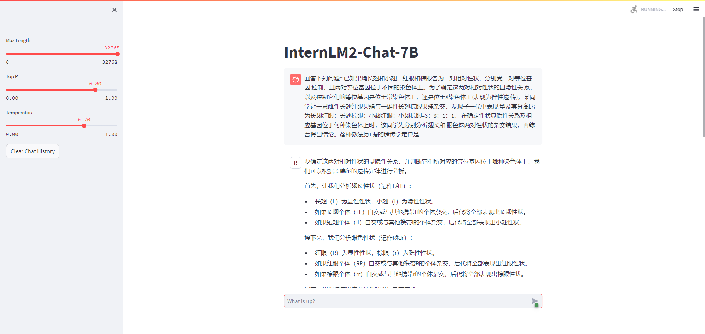
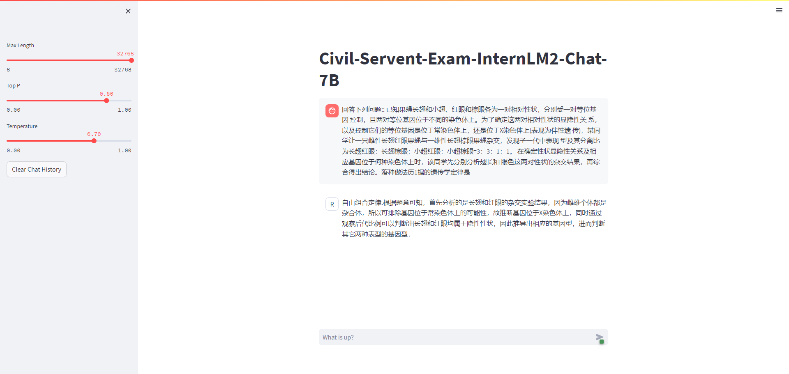

# CivilservantExam-Chat  公务员考试大模型

<div align="center">


  <div align="center">
    <b><font size="5">CivilservantExam-Chat</font></b>
  </div>

[🤗HuggingFace][HuggingFace_Model-url]

[HuggingFace_Model-url]: https://modelscope.cn/models/yangchanghui/civil-exam-internlm2-chat-7B/summary

## 📖 简介

CivilservantExam chat 是一个集成了公务员考试试题及其解答的大语言模型。该模型目前仅使用公开的公务员考试试题数据集[COIG](https://link.zhihu.com/?target=https%3A//huggingface.co/datasets/BAAI/COIG)，基于 InternLM2-Math-7B 模型，通过 xtuner 微调，专门设计用于解答公务员考试问题。目前使用的数据集有限，后续会尝试加入更多的数据集，以提升模型的泛化能力。

如果你觉得这个项目对你有帮助，欢迎 ⭐ Star，让更多的人发现它！

## 📑 数据集准备

### 1. 下载数据集
[COIG](https://link.zhihu.com/?target=https%3A//huggingface.co/datasets/BAAI/COIG)

### 2. 数据预处理

数据集格式：
[dataset_format](https://github.com/InternLM/xtuner/blob/main/docs/zh_cn/user_guides/dataset_format.md)
数据准备:
[dataset_prepare](https://github.com/InternLM/xtuner/blob/main/docs/zh_cn/user_guides/dataset_prepare.md)


#### 🚀 XTuner微调

1. 准备配置文件

```bash
# 列出所有内置配置
xtuner list-cfg

mkdir /root/civil-exam/config && cd /root/civil-exam/config

xtuner copy-cfg internlm2_chat_7b_qlora_oasst1_e3 .
```

2. 模型下载

```bash
mkdir -p /root/civil-exam/model
```
`download.py`

```python
import torch
from modelscope import snapshot_download, AutoModel, AutoTokenizer
import os
model_dir = snapshot_download('yangchanghui/civil-exam-internlm2-chat-7B', cache_dir='/root/civil-exam/model')
```


3. 修改配置文件

```bash
cd /root/civil-exam/config
vim internlm2_chat_7b_qlora_oasst1_e3_copy.py
```

```python
# 修改模型为本地路径
- pretrained_model_name_or_path = 'internlm/internlm-chat-7b'
+ pretrained_model_name_or_path = '/root/civil-exam/model/civil-exam-internlm2-chat-7B'

# 修改训练数据集为本地路径
- data_path = 'timdettmers/openassistant-guanaco'
+ data_path = '/root/civil-exam/exam_instructions_inernlm.jsonl'
- dataset=dict(type=load_dataset, path=data_path)

+ dataset=dict(
+       type=load_dataset, path='json', data_files=dict(train=data_path))

- dataset=dict(type=load_dataset, path=data_path)
+ dataset=dict(
+       type=load_dataset, path='json', data_files=dict(train=data_path))
```


4. 开始微调

```bash
cd ..
xtuner train /root/civil-exam/config/internlm2_chat_7b_qlora_oasst1_e3_copy.py --deepspeed deepspeed_zero2
```

5. PTH 模型转换为 HuggingFace 模型

```bash
mkdir /root/civil-exam/model/hf
xtuner convert pth_to_hf /root/civil-exam/config/internlm2_chat_7b_qlora_oasst1_e3_copy.py \
                         ./work_dirs/internlm2_chat_7b_qlora_oasst1_e3_copy/epoch_3.pth \
                         /root/civil-exam/model/hf
```

6. HuggingFace 模型合并到大语言模型
```bash
export MKL_SERVICE_FORCE_INTEL=1
export MKL_THREADING_LAYER='GNU'

# 原始模型参数存放的位置
export NAME_OR_PATH_TO_LLM=/root/civil-exam/model/Shanghai_AI_Laboratory/internlm2-chat-7b

# Hugging Face格式参数存放的位置
export NAME_OR_PATH_TO_ADAPTER=/root/civil-exam/model/hf

# 最终Merge后的参数存放的位置
mkdir /root/civil-exam/model/hf_merge
export SAVE_PATH=/root/civil-exam/model/hf_merge

# 执行参数Merge
xtuner convert merge \
    $NAME_OR_PATH_TO_LLM \
    $NAME_OR_PATH_TO_ADAPTER \
    $SAVE_PATH \
    --max-shard-size 2GB
```

具体步骤：
[incremental_pretraining](https://github.com/InternLM/xtuner/blob/main/docs/zh_cn/user_guides/incremental_pretraining.md)

7. Demo

微调前:
<p align="center">
    
</p>


微调后：
<p align="center">
    
</p>

- CivilservantExam-Chat 与 InternLM2-Math-7B 对于同一道公务员试题的回答中： 
  CivilservantExam 回答正确，InternLM2-Math-7B 回答错误。

### 特别鸣谢

<div align="center">

***感谢上海人工智能实验室组织的 书生·浦语实战营 学习活动~***

***感谢 OpenXLab 对项目部署的算力支持~***

***感谢 浦语小助手 对项目的支持~***

***感谢上海人工智能实验室推出的书生·浦语大模型实战营，为我们的项目提供宝贵的技术指导和强大的算力支持！***

[**InternLM-tutorial**](https://github.com/InternLM/tutorial)、[**InternStudio**](https://studio.intern-ai.org.cn/)、[**xtuner**](https://github.com/InternLM/xtuner)、[**AMchat**](https://github.com/AXYZdong/AMchat/tree/main)
